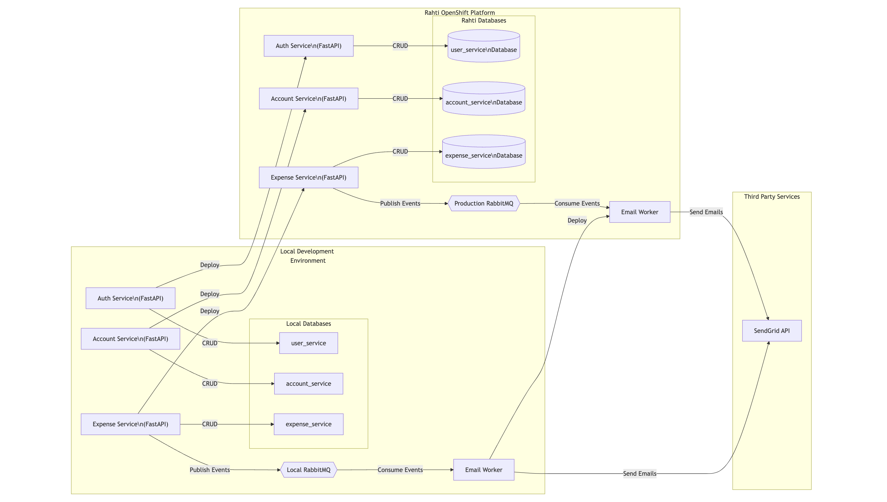

# Expense Tracker Microservice Project

## Overview
This project is a microservice-based application that helps users manage their daily expenses and encourages saving money. Each microservice operates independently, with its own database and Docker configuration. The system also integrates third-party services (SendGrid) and RabbitMQ for email notifications when expenses exceed a defined threshold.

## Features
- **User Authentication**: Secure user login and registration.
- **Expense Tracking**: Allows users to record and track daily expenses.
- **Account Management**: Provides account-related functionalities.
- **Email Notifications**: Sends emails using RabbitMQ and SendGrid when expenses exceed $10.
- **Microservice Architecture**: Services are decoupled, each with its own database and Docker container.
- **PostgreSQL Database**: Each service uses its own PostgreSQL database.
- **Deployment on Rahti**: All services are deployed on the Rahti cloud platform.


---

## Folder Structure
```
project_folder
|
|-- front-end                # React front-end code
|   |-- public
|   |-- src
|
|-- backend                  # Backend microservices and worker code
|   |
|   |-- auth_service         # Handles user authentication
|   |   |-- database.py
|   |   |-- main.py
|   |   |-- routes.py
|   |   |-- Dockerfile
|   |
|   |-- expense_service      # Manages expense records
|   |   |-- database.py
|   |   |-- main.py
|   |   |-- routes.py
|   |   |-- Dockerfile
|   |
|   |-- account_service      # Handles account-related functionalities
|   |   |-- database.py
|   |   |-- main.py
|   |   |-- routes.py
|   |   |-- Dockerfile
|   |
|   |-- email_worker         # Email worker service for SendGrid and RabbitMQ
|   |   |-- main.py
|   |   |-- Dockerfile
|
|-- docker-compose.yml       # Compose file to manage Docker containers
```

---

## Prerequisites

Ensure you have the following installed:
- [Node.js](https://nodejs.org/)
- [Python 3.8+](https://www.python.org/downloads/)
- [Docker](https://www.docker.com/)
- PostgreSQL database server
- RabbitMQ

---

## Installation and Setup

### Front-End
Navigate to the `front-end` folder and run the following commands:
```bash
# Install dependencies
npm install

# Start the development server
npm run build # run this command before `npm run dev`

npm run dev
```

### Database Setup
Ensure PostgreSQL is running and create separate databases for each service 
 - user_services (auth_service db)
 - expense_service (expense_serice db)
 - account_service (account_service db)
Update the connection details in each service's `database.py` file.


### Backend
Navigate to the `backend` folder and set up the virtual environment:

```bash
# Create a virtual environment
python -m venv venv

# Activate the virtual environment
# On Windows:
venv\Scripts\activate
# On macOS/Linux:
source venv/bin/activate

# Install required packages
pip install -r requirements.txt
```

### RabbitMQ Setup
To set up RabbitMQ, run the following command:
```bash
docker run -d --name rabbitmq -p 5672:5672 -p 15672:15672 rabbitmq:3-management
```
Access RabbitMQ Management at [http://localhost:15672](http://localhost:15672).

---

## Dependencies

### Front-End
- React.js

### Backend
- FastAPI
- Uvicorn
- RabbitMQ
- SendGrid
- Docker

---

## Docker Setup
Each service has its own Dockerfile. Use the `docker-compose.yml` file to build and start all services:

```bash
cd backend
  docker-compose up --build
```

This will:
- Build Docker images for each service.
- Start all containers, including RabbitMQ.

---

## Workflow
1. **User adds an expense:**
   - If the expense value exceeds $10, the `expense_service` triggers the `email_worker` service.
2. **Email Worker:**
   - Sends a message to RabbitMQ.
   - Processes the message and uses SendGrid to send an email notification.
3. **Services Communication:**
   - All services operate independently, communicating via RabbitMQ and APIs.

---

## Commands Summary

### Front-End Commands
```bash
npm install   # Install dependencies
npm run dev   # Start development server
```

### Backend Commands
```bash
# Create and activate a virtual environment
python -m venv venv
source venv/bin/activate

# Install requirements
pip install -r requirements.txt

# Windows user can replace 0.0.0.0 with 127.0.0.1.

# Run individual services
cd auth_service && uvicorn main:auth_service --reload --host 0.0.0.0 --port 8001
cd expense_service && uvicorn main:expense_service --reload --host 0.0.0.0 --port 8002
cd account_service && uvicorn main:account_service --reload --host 0.0.0.0 --port 8003

# Run email worker
python email_worker/main.py
```

### RabbitMQ Command
```bash
docker run -d --name rabbitmq -p 5672:5672 -p 15672:15672 rabbitmq:3-management

```

## Deployment on Rahti
All services are deployed on the Rahti cloud platform. Ensure you configure each service's deployment file to include environment variables for RabbitMQ and PostgreSQL connection details.


## Contributing
Contributions are welcome! Feel free to fork this repository and submit a pull request.




